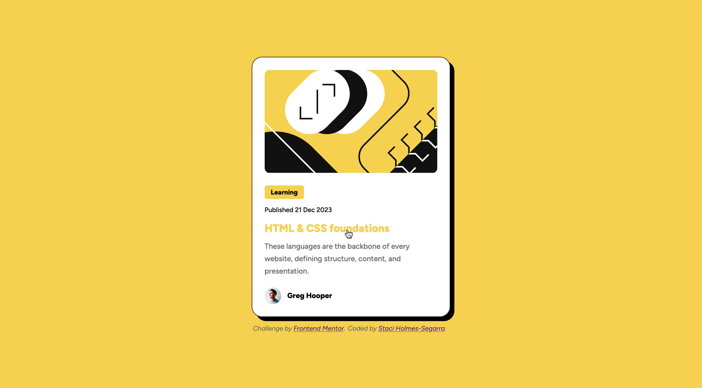

# Frontend Mentor - Blog preview card solution

This is a solution to the [Blog preview card challenge on Frontend Mentor](https://www.frontendmentor.io/challenges/blog-preview-card-ckPaj01IcS). Frontend Mentor challenges help you improve your coding skills by building realistic projects.

## Table of contents

- [Overview](#overview)
  - [The challenge](#the-challenge)
  - [Screenshots](#screenshots)
  - [Links](#links)
- [My process](#my-process)
  - [Built with](#built-with)
  - [What I learned](#what-i-learned)
  - [Useful resources](#useful-resources)
- [Author](#author)

## Overview

### The challenge

Users should be able to:

- See hover and focus states for all interactive elements on the page

### Screenshots

<figure>
  
  <figcaption>Desktop</figcaption>
</figure>
<figure>
  
  <figcaption>Desktop with hover</figcaption>
</figure>
<figure>
  
  <figcaption>Mobile</figcaption>
</figure>

### Links

- Live Site URL: [Blog card live site link](https://staci-blog-preview-card.netlify.app)

## My process

I linked two separate CSS stylesheets to my index.html file. I have my blog_card.css file, as well as my resets.css file. The resets file is used to get around browser built-in styles. It is reuseable for any project. I decided to go with the mobile first approach. This seems like the most logical method to me because it is easier to add elements instead of removing them. I then started styling from the top to the bottom one section at a time.

### Built with

- Semantic HTML5 markup
- CSS custom properties
- Flexbox
- Mobile-first workflow

### What I learned

The @font-face rule was completely new to me. I enjoyed reading up on it and applying it to this challenge. I knew I wanted to use CSS variables with the colors, but had to refresh myself on how to do it. I applied these variables in the root to make them universal. In future challenges, I want to apply CSS variables to other properties. I also added the font-size to the root since users can change this in their browsers. Then I used the rem unit for font-size, in the file, to allow for responsive sizing.

```css
.:root {
  --main-bg-color: #f4d04e;
  --black: #111111;
  --gray: #6b6b6b;
  --white: #ffffff;
  font-size: 16px;
}
```

### Useful resources

- [CSS-Tricks](https://css-tricks.com/) - This site has a wealth of knowledge on all things CSS. I came here for help with @font-face.
- [MDN](https://developer.mozilla.org/en-US/) - This is another site that covers CSS as well as HTML, JavaScript and Web APIs.
- [nekoCalc](https://nekocalc.com/) - I used this to convert px to rem. The site has other calculators you can use, such as converting from px to percentage.

## Author

- Frontend Mentor - [@Stacihs](https://www.frontendmentor.io/profile/Stacihs/solutions)
